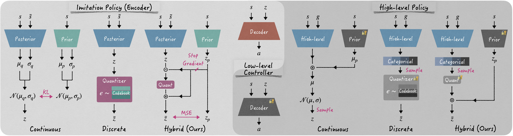
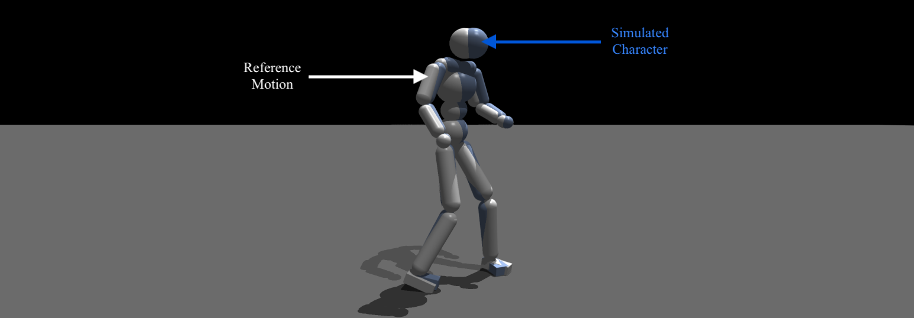
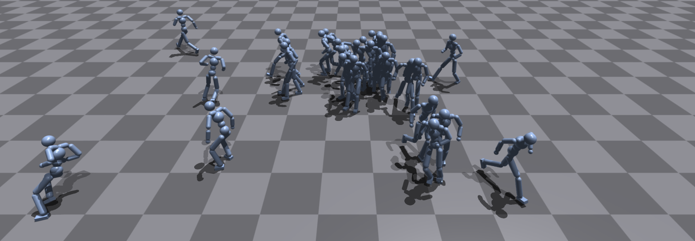
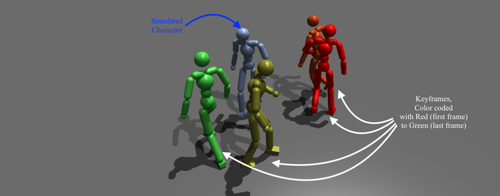
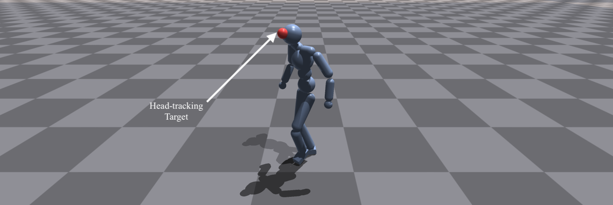
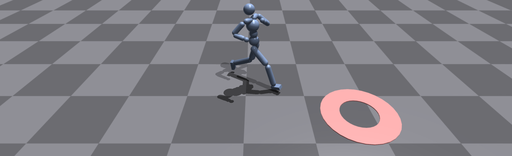

# hybrid_latent_prior
This is an official implementation for Eurographics 2025 paper titled "Versatile Physics-based Character Control with Hybrid Latent Representation".
We provide codes for all the training and testing environments demonstrated in the main paper.


## Installation
This code is based on [Isaac Gym Preview 4](https://developer.nvidia.com/isaac-gym).
Please run installation code and create a conda environment following the instruction in Isaac Gym Preview 4.
We assume the name of conda environment is `hlr_env` (hybrid latent representation).
Then, run the following script.

```shell
conda activate hlr_env
cd hybrid_latent_prior
pip install -e .
bash setup_conda_env_extra.sh
```

## Data
In the paper, we mainly use [LaFAN1](https://github.com/ubisoft/ubisoft-laforge-animation-dataset) dataset.
However, due to the license issue, we cannot distribute the whole dataset retargeted to the humanoid. 
We strongly recommend you to retarget original LaFAN1 motions using codes under following our [instruction](isaacgymenvs/tasks/amp/poselib/README.md).
If you have any problem, please reach us via e-mail.


## Models
<div style="text-align:center">

</div>
<br/>
We provide implementations of all the baselines (continuous, discrete, discrete_plus) along with our hybrid latent model.

Our implementations of the baselines are based on the previous works of [UHC](https://github.com/ZhengyiLuo/UHC) and [NCP](https://github.com/Tencent-RoboticsX/NCP), respectively for the continuous and discrete models.

You can find the implemented model architectures in  `isaacgymenvs/learning/cvae_network_builder.py`.

We also share the pretrained models for all types of the imitation and task policies. 
You can download the pretrained weights through [Google Drive](https://drive.google.com/file/d/1gEnpnCDHP5ysDTW3rE_ftUlp8cRcMRmh/view?usp=sharing) and unzip this folder under `isaacgymenvs/`.
You may run these models following the commands in the next section.


## Run
We provide instructions about training and testing the models.
Also to run all the scripts here, assume you are in the `isaacgymenvs/` directory.

```shell
cd isaacgymenvs
```

### Stage 1) Imitation Learning
<div style="text-align:center">

</div>
<br/>
We follow the [online distillation](https://arxiv.org/abs/2310.04582) scheme to train our imitation policy.
Online distillation requires an expert imitation policy.
As addressed in the main paper, we provide example code to train an expert policy.
However, we remind that you may use different methods to train an expert imitation policy, such as [PHC](https://openaccess.thecvf.com/content/ICCV2023/html/Luo_Perpetual_Humanoid_Control_for_Real-time_Simulated_Avatars_ICCV_2023_paper.html) for extremely large dataset (e.g. AMASS).

You can run the following scripts to train an expert imitation policy and visualize the results:

<details><summary><strong>Imitation - Expert</strong></summary>

```shell
# train
python train.py headless=True task=LafanImitation train=imitation/ExpertPPO experiment=imitation_expert

# test
python train.py test=True num_envs=1 task=LafanImitation train=imitation/ExpertPPO checkpoint=pretrained_weights/imitation/imitation_expert/nn/imitation_expert_weight.pth
```
</details>


Once an expert policy is trained, you can train the latent models using the pretrained expert policy:

<details><summary><strong>Imitation - Hybrid (Ours)</strong></summary>

```shell
# train
python train.py headless=True task=LafanImitation train=imitation/HybridDistill experiment=imitation_hybrid expert=pretrained_weights/imitation/imitation_expert

# test
python train.py test=True num_envs=1 task=LafanImitation train=imitation/HybridDistill checkpoint=pretrained_weights/imitation/imitation_hybrid/nn/imitation_hybrid_weight.pth
```

</details>

<details><summary><strong>Imitation - Continuous</strong></summary>

```shell
# train
python train.py headless=True task=LafanImitation train=imitation/HybridDistill experiment=imitation_hybrid expert=pretrained_weights/imitation/imitation_expert

# test
python train.py test=True num_envs=1 task=LafanImitation train=imitation/ContinuousDistill checkpoint=pretrained_weights/imitation/imitation_continuous/nn/imitation_continuous_weight.pth
```
</details>

<details><summary><strong>Imitation - Discrete</strong></summary>

```shell
# train
python train.py headless=True task=LafanImitation train=imitation/DiscreteDistill experiment=imitation_discrete quant_type=simple code_num=8192 expert=pretrained_weights/imitation/imitation_expert

# test
python train.py test=True num_envs=1 task=LafanImitation train=imitation/DiscreteDistill checkpoint=pretrained_weights/imitation/imitation_discrete/nn/imitation_discrete_weight.pth quant_type=simple code_num=8192
```
</details>

<details><summary><strong>Imitation - Discrete Plus </strong></summary>

```shell
# train
python train.py headless=True task=LafanImitation train=imitation/DiscreteDistill experiment=imitation_discrete_plus expert=pretrained_weights/imitation/imitation_expert

# test
python train.py test=True num_envs=1 task=LafanImitation train=imitation/DiscreteDistill checkpoint=pretrained_weights/imitation/imitation_discrete_plus/nn/imitation_discrete_plus_weight.pth
```
</details>

<div style="text-align:center">

</div>
<br/>

After training an imitation policy, unconditional generation can be performed using prior sampling.
We additionally provide commands to run prior sampling.

<details><summary><strong>Unconditional Generation - Hybrid (Ours)</strong></summary>

```shell
# test
python train.py test=True num_envs=30 prior_rollout=True task=LafanImitation train=imitation/HybridDistill checkpoint=pretrained_weights/imitation/imitation_hybrid/nn/imitation_hybrid_weight.pth
```

</details>

<details><summary><strong>Unconditional Generation - Continuous</strong></summary>

```shell
# test
python train.py test=True num_envs=30 prior_rollout=True task=LafanImitation train=imitation/ContinuousDistill checkpoint=pretrained_weights/imitation/imitation_continuous/nn/imitation_continuous_weight.pth
```
</details>

<details><summary><strong>Unconditional Generation - Discrete</strong></summary>

```shell
# test
python train.py test=True num_envs=30 prior_rollout=True task=LafanImitation train=imitation/DiscreteDistill checkpoint=pretrained_weights/imitation/imitation_discrete/nn/imitation_discrete_weight.pth quant_type=simple code_num=8192
```
</details>

<details><summary><strong>Unconditional Generation - Discrete Plus </strong></summary>

```shell
# test
python train.py test=True num_envs=30 prior_rollout=True task=LafanImitation train=imitation/DiscreteDistill checkpoint=pretrained_weights/imitation/imitation_discrete_plus/nn/imitation_discrete_plus_weight.pth
```
</details>


### Stage 2) Task Learning
Once the imitation policy is trained, you can train a high-level policy that is task-specific to each scenario.
Similar to the imtation learning, we provide scripts to train and test the high-level polices.


<div style="text-align:center">

</div>
<br/>

<details><summary><strong>Motion In-betweening - Hybrid (Ours) </strong></summary>

```shell
# train - motion in-betweening
python train.py headless=True task=LafanInbetweening train=tasks/LafanMibLatentMultiDiscretePPO pretrained=pretrained_weights/imitation/imitation_hybrid experiment=inbetweening_hybrid

# test - motion in-betweening
python train.py test=True num_envs=1 task=LafanInbetweening train=tasks/LafanMibLatentMultiDiscretePPO pretrained=pretrained_weights/imitation/imitation_hybrid checkpoint=pretrained_weights/inbetweening/inbetweening_hybrid/nn/inbetweening_hybrid_weight.pth
```
</details>

<details><summary><strong>Motion In-betweening - Continuous </strong></summary>

```shell
# train - motion in-betweening
python train.py headless=True task=LafanInbetweening train=tasks/LafanMibLatentContinuousPPO pretrained=pretrained_weights/imitation/imitation_continuous experiment=inbetweening_continuous

# test - motion in-betweening
python train.py test=True num_envs=1 task=LafanInbetweening train=tasks/LafanMibLatentContinuousPPO pretrained=pretrained_weights/imitation/imitation_continuous checkpoint=pretrained_weights/inbetweening/inbetweening_continuous/nn/inbetweening_continuous_weight.pth
```
</details>

<details><summary><strong>Motion In-betweening - Discrete </strong></summary>

```shell
# train - motion in-betweening
python train.py headless=True task=LafanInbetweening train=tasks/LafanMibLatentDiscretePPO pretrained=pretrained_weights/imitation/imitation_discrete experiment=inbetweening_discrete

# test - motion in-betweening
python train.py test=True num_envs=1 task=LafanInbetweening train=tasks/LafanMibLatentDiscretePPO pretrained=pretrained_weights/imitation/imitation_discrete checkpoint=pretrained_weights/inbetweening/inbetweening_discrete/nn/inbetweening_discrete_weight.pth
```
</details>

<details><summary><strong>Motion In-betweening - Discrete Plus</strong></summary>

```shell
# train - motion in-betweening
python train.py headless=True task=LafanInbetweening train=tasks/LafanMibLatentMultiDiscretePPO pretrained=pretrained_weights/imitation/imitation_discrete_plus experiment=inbetweening_discrete_plus

# test - motion in-betweening
python train.py test=True num_envs=1 task=LafanInbetweening train=tasks/LafanMibLatentMultiDiscretePPO pretrained=pretrained_weights/imitation/imitation_discrete_plus checkpoint=pretrained_weights/inbetweening/inbetweening_discrete_plus/nn/inbetweening_discrete_plus_weight.pth
```
</details>


<div style="text-align:center">

</div>
<br/>

<details><summary><strong>Head-mounted Device Tracking - Hybrid (Ours) </strong></summary>

```shell
# train - head mounted device tracking
python train.py headless=True task=LafanTracking train=tasks/LafanTrackLatentMultiDiscretePPO pretrained=pretrained_weights/imitation/imitation_hybrid experiment=tracking_hybrid

# test - head mounted device tracking
python train.py test=True num_envs=1 task=LafanTracking train=tasks/LafanTrackLatentMultiDiscretePPO pretrained=pretrained_weights/imitation/imitation_hybrid checkpoint=pretrained_weights/tracking/tracking_hybrid/nn/tracking_hybrid_weight.pth
```
</details>

<details><summary><strong>Head-mounted Device Tracking - Continuous </strong></summary>

```shell
# train - head mounted device tracking
python train.py headless=True task=LafanTracking train=tasks/LafanTrackLatentContinuousPPO pretrained=pretrained_weights/imitation/imitation_continuous experiment=tracking_continuous

# test - head mounted device tracking
python train.py test=True num_envs=1 task=LafanTracking train=tasks/LafanTrackLatentContinuousPPO pretrained=pretrained_weights/imitation/imitation_continuous checkpoint=pretrained_weights/tracking/tracking_continuous/nn/tracking_continuous_weight.pth
```
</details>


<details><summary><strong>Head-mounted Device Tracking - Discrete </strong></summary>

```shell
# train - head mounted device tracking
python train.py headless=True task=LafanTracking train=tasks/LafanTrackLatentDiscretePPO pretrained=pretrained_weights/imitation/imitation_discrete experiment=tracking_discrete

# test - head mounted device tracking
python train.py test=True num_envs=1 task=LafanTracking train=tasks/LafanTrackLatentDiscretePPO pretrained=pretrained_weights/imitation/imitation_discrete checkpoint=pretrained_weights/tracking/tracking_discrete/nn/tracking_discrete_weight.pth
```
</details>

<details><summary><strong>Head-mounted Device Tracking - Discrete Plus</strong></summary>

```shell
# train - head mounted device tracking
python train.py headless=True task=LafanTracking train=tasks/LafanTrackLatentMultiDiscretePPO pretrained=pretrained_weights/imitation/imitation_discrete_plus experiment=tracking_discrete_plus

# test - head mounted device tracking
python train.py test=True num_envs=1 task=LafanTracking train=tasks/LafanTrackLatentMultiDiscretePPO pretrained=pretrained_weights/imitation/imitation_discrete_plus checkpoint=pretrained_weights/tracking/tracking_discrete_plus/nn/tracking_discrete_plus_weight.pth
```
</details>


<div style="text-align:center">

</div>
<br/>


<details><summary><strong>Point-goal Navigation - Hybrid (Ours) </strong></summary>

```shell
# train - point-goal navigation
python train.py headless=True task=LafanNavigation train=tasks/LafanNavLatentMultiDiscretePPO pretrained=pretrained_weights/imitation/imitation_hybrid experiment=navigation_hybrid

# test - point-goal navigation
python train.py test=True num_envs=1 task=LafanNavigation train=tasks/LafanNavLatentMultiDiscretePPO pretrained=pretrained_weights/imitation/imitation_hybrid checkpoint=pretrained_weights/navigation/navigation_hybrid/nn/navigation_hybrid_weight.pth
```
</details>

<details><summary><strong>Point-goal Navigation - Continuous </strong></summary>

```shell
# train - point-goal navigation
python train.py headless=True task=LafanNavigation train=tasks/LafanNavLatentContinuousPPO pretrained=pretrained_weights/imitation/imitation_continuous experiment=navigation_continuous

# test - point-goal navigation
python train.py test=True num_envs=1 task=LafanNavigation train=tasks/LafanNavLatentContinuousPPO pretrained=pretrained_weights/imitation/imitation_continuous checkpoint=pretrained_weights/navigation/navigation_continuous/nn/navigation_continuous_weight.pth
```
</details>


<details><summary><strong>Point-goal Navigation - Discrete </strong></summary>

```shell
# train - point-goal navigation
python train.py headless=True task=LafanNavigation train=tasks/LafanNavLatentDiscretePPO pretrained=pretrained_weights/imitation/imitation_discrete experiment=navigation_discrete

# test - point-goal navigation
python train.py test=True num_envs=1 task=LafanNavigation train=tasks/LafanNavLatentDiscretePPO pretrained=pretrained_weights/imitation/imitation_discrete checkpoint=pretrained_weights/navigation/navigation_discrete/nn/navigation_discrete_weight.pth
```
</details>

<details><summary><strong>Point-goal Navigation - Discrete Plus</strong></summary>

```shell
# train - point-goal navigation
python train.py headless=True task=LafanNavigation train=tasks/LafanNavLatentMultiDiscretePPO pretrained=pretrained_weights/imitation/imitation_discrete_plus experiment=navigation_discrete_plus

# test - point-goal navigation
python train.py test=True num_envs=1 task=LafanNavigation train=tasks/LafanNavLatentMultiDiscretePPO pretrained=pretrained_weights/imitation/imitation_discrete_plus checkpoint=pretrained_weights/navigation/navigation_discrete_plus/nn/navigation_discrete_plus_weight.pth
```
</details>

## License
This repository contains three types of code:
1. Code originally authored by NVIDIA (Isaac Gym), licensed under the [BSD 3-Clause License](third_party/LICENSE.txt).
2. PyTorch implementaion on the various vector quantization methods `vector_quantize_pytorch`(https://github.com/lucidrains/vector-quantize-pytorch), licensed under the [MIT License](https://github.com/lucidrains/vector-quantize-pytorch?tab=MIT-1-ov-file).
3. Code authored by ourselves, licensed under the [MIT License](LICENSE).